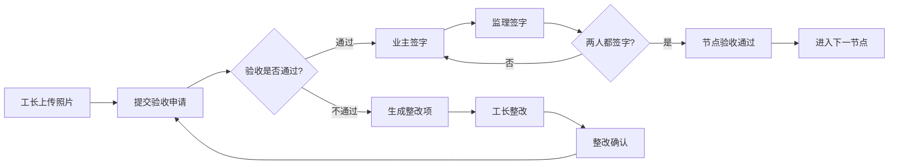

## 1. 产品概述

装修隐蔽工程验收簿是一款面向家装工程的数字化验收工具，用于规范和记录水电走线、防水闭水、吊顶龙骨、墙面基层等隐蔽工程的验收流程。

- 解决传统纸质验收不规范、追溯难、责任不清的问题
- 目标用户：工长、业主、监理三方协同
- 核心价值：流程标准化、证据留痕、责任明确、质量可控

## 2. 核心功能

### 2.1 用户角色

| 角色 | 登录方式 | 核心权限 |
|------|----------|----------|
| 工长 | 角色切换 | 上传验收照片、提交验收申请、查看整改项、完成整改 |
| 业主 | 角色切换 | 查看验收节点、签字确认验收、提出整改意见 |
| 监理 | 角色切换 | 专业验收评估、签字确认、生成整改项 |

### 2.2 功能模块

1. **验收总览页**：四个验收节点进度展示、整体验收状态
2. **节点详情页**：照片展示、签字区域、整改项列表、操作按钮
3. **整改管理**：整改项创建、整改前后对比、整改确认
4. **角色切换**：支持工长/业主/监理三种视角切换

### 2.3 页面详情

| 页面名称 | 模块名称 | 功能描述 |
|---------|----------|----------|
| 验收总览页 | 进度概览 | 四个节点进度条、当前状态、已签字人数 |
| 验收总览页 | 节点卡片 | 节点名称、状态标识、缩略图预览、进入详情 |
| 节点详情页 | 照片展示区 | 工长上传的验收照片、大图预览 |
| 节点详情页 | 签字区域 | 业主和监理签字状态显示、签字操作 |
| 节点详情页 | 整改项列表 | 未通过项展示、整改状态追踪 |
| 节点详情页 | 操作区 | 提交验收、添加整改、确认整改 |
| 角色切换 | 顶部切换栏 | 快速切换工长/业主/监理视角 |

## 3. 核心流程

工长上传节点照片后提交验收申请，业主和监理需分别签字确认。若验收未通过则生成整改项，整改完成并确认后方可进入下一道工序。

## 4. 用户界面设计

### 4.1 设计风格

- **主色调**：工程蓝 (#165DFF)，代表专业、可靠
- **辅助色**：警示橙 (#FF7D00) 用于整改提醒，成功绿 (#00B42A) 用于验收通过
- **按钮风格**：圆角矩形按钮，主按钮实色填充，次按钮描边
- **字体**：思源黑体，清晰易读的工程风格
- **布局风格**：卡片式布局，清晰的分区和层级
- **图标风格**：线性图标，简洁专业

### 4.2 页面设计概述

| 页面名称 | 模块名称 | UI元素 |
|---------|----------|--------|
| 验收总览页 | 顶部栏 | 项目名称、角色切换按钮 |
| 验收总览页 | 进度概览 | 横向步骤条、节点状态指示 |
| 验收总览页 | 节点卡片网格 | 2x2 卡片布局，节点名称、状态标签、缩略图、操作按钮 |
| 节点详情页 | 返回导航 | 返回按钮、节点标题、状态徽章 |
| 节点详情页 | 照片画廊 | 网格照片展示、点击放大预览 |
| 节点详情页 | 签字面板 | 业主和监理签字卡片、签字状态、签字按钮 |
| 节点详情页 | 整改项列表 | 整改项卡片、状态标签、描述文字、整改前后照片 |
| 节点详情页 | 底部操作栏 | 固定底部的主要操作按钮 |

### 4.3 响应式

- 桌面端优先设计，平板自适应
- 移动端单列布局，优化触摸操作
- 照片展示区域自适应缩放

### 4.4 交互细节

- 节点状态切换带平滑过渡动画
- 签字时带笔迹书写动效
- 整改项展开/收起有折叠动画
- 进度更新有数字递增动效
