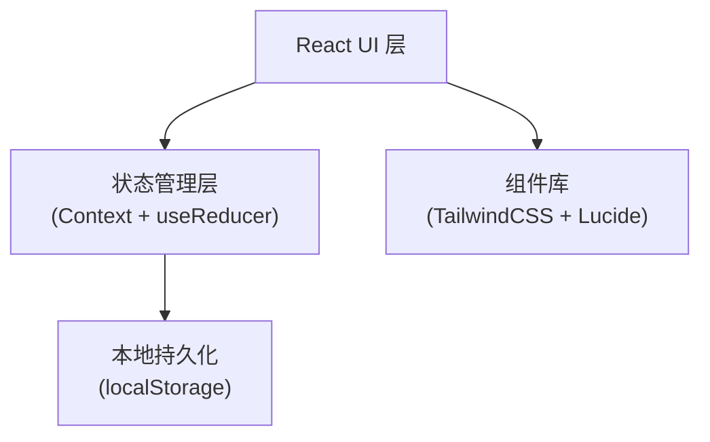
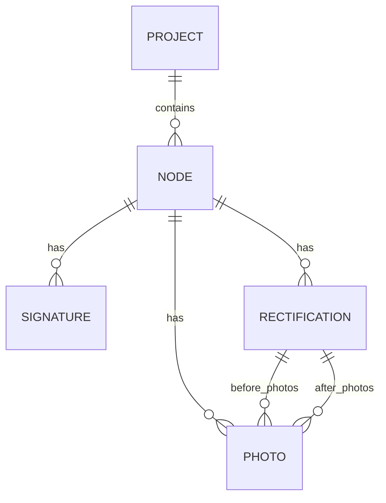

## 1. 架构设计



## 2. 技术描述

- **前端框架**：React@18 + TypeScript + Vite@5
- **样式方案**：TailwindCSS@3
- **状态管理**：React Context + useReducer
- **路由**：React Router DOM@6
- **图标库**：Lucide React
- **数据存储**：localStorage 本地持久化 + Mock 初始数据
- **图片处理**：使用图片 URL 模拟上传，支持本地文件预览
- **签字功能**：Canvas 手写签字

## 3. 路由定义

| 路由 | 用途 |
|------|------|
| / | 验收总览页，展示四个节点进度 |
| /node/:id | 节点详情页，照片、签字、整改项 |

## 4. 数据模型

### 4.1 数据模型定义



### 4.2 类型定义

```typescript
type Role = 'foreman' | 'owner' | 'supervisor'

type NodeStatus = 'pending' | 'submitted' | 'rejected' | 'passed'

interface Photo {
  id: string
  url: string
  caption?: string
  uploadAt: string
  uploadBy: Role
}

interface Signature {
  role: Role
  name: string
  signed: boolean
  signedAt?: string
  signatureData?: string
}

interface Rectification {
  id: string
  description: string
  status: 'pending' | 'resolved' | 'verified'
  createdAt: string
  createdBy: Role
  beforePhotos: Photo[]
  afterPhotos: Photo[]
  resolvedAt?: string
  verifiedAt?: string
}

interface AcceptanceNode {
  id: string
  name: string
  description: string
  icon: string
  status: NodeStatus
  photos: Photo[]
  signatures: Signature[]
  rectifications: Rectification[]
  submittedAt?: string
  passedAt?: string
}

interface Project {
  id: string
  name: string
  address: string
  nodes: AcceptanceNode[]
  currentRole: Role
}
```

## 5. 状态管理设计

### 5.1 State 结构

```typescript
interface AppState {
  project: Project
  currentRole: Role
}
```

### 5.2 Actions

- `SET_ROLE` - 切换当前角色
- `UPLOAD_PHOTO` - 上传照片
- `SUBMIT_NODE` - 提交节点验收
- `SIGN_NODE` - 签字确认
- `ADD_RECTIFICATION` - 添加整改项
- `RESOLVE_RECTIFICATION` - 提交整改
- `VERIFY_RECTIFICATION` - 验证整改
- `PASS_NODE` - 通过节点验收

## 6. 核心组件

| 组件名 | 用途 |
|--------|------|
| RoleSwitcher | 角色切换器 |
| ProgressTimeline | 进度时间线 |
| NodeCard | 节点卡片 |
| PhotoGallery | 照片画廊 |
| SignaturePanel | 签字面板 |
| RectificationList | 整改项列表 |
| RectificationItem | 整改项条目 |
| SignatureCanvas | 手写签字画布 |
| PhotoUploader | 照片上传组件 |

## 7. 业务规则

1. **流程顺序**：四个节点按顺序进行，前一节点未通过不能进入下一节点
2. **签字规则**：业主和监理都签字后节点才算通过
3. **整改阻塞**：存在未完成整改项时，不能提交验收、不能通过验收
4. **角色权限**：
   - 工长：上传照片、提交验收、提交整改
   - 业主：签字、查看整改项
   - 监理：签字、添加整改项、验证整改
5. **状态流转**：待提交 → 已提交 → (有整改项 → 整改中 → 已整改 → 已验证) → 已通过
